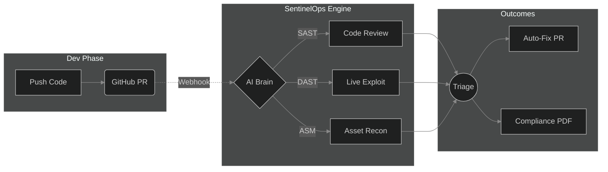

<div align="center">
  <br />
  <h1>
    
    <br />
    SentinelOps
  </h1>
  <p>
    <b>The Next-Generation PTaaS (Pentesting as a Service) Platform</b>
  </p>
  <p>
    <sup>
      Offensive security, continuous recon, and AI-driven vulnerability reasoning—built for modern DevSecOps.
    </sup>
  </p>

  <p>
    <a href="#-the-arsenal-features"></a>
    <a href="#-getting-started"></a>
    <a href="#%EF%B8%8F-how-it-works"></a>
  </p>
</div>

<br />

> **SentinelOps** replaces fragmented security tools with a unified, autonomous engine. We bring Fortune 500-grade penetration testing directly to your CI/CD pipeline, catching vulnerabilities before they ever hit production.

<br />

## ⚡ The Arsenal (Features)

SentinelOps is not just a scanner; it's a full-spectrum security mesh designed to outsmart modern threats.

| Capability | Description |
| :--- | :--- |
| 🌍 **Attack Surface Management** | Continuous discovery of subdomains, exposed panels, open ports, and orphan DNS records using our containerized recon-engine. |
| 🛡️ **Full-Spectrum Pentesting** | **Whitebox:** Deep SAST code analysis.<br>**Greybox:** Authenticated DAST testing & privilege escalation checks.<br>**Blackbox:** Zero-knowledge active exploitation and fuzzing. |
| 🤖 **AI-Powered PR Security** | Gemini & OpenRouter AI models automatically review GitHub PRs, leaving actionable comments and auto-remediation patches. |
| 🚀 **CI/CD Integration** | Shift-left security. Pipeline breakers for Critical/High CVEs, seamlessly integrating with GitHub Actions, GitLab, and Bitbucket. |
| 📊 **Compliance & Reporting** | 1-click generation of executive PDF reports mapped directly to SOC2, ISO27001, HIPAA, and GDPR compliance frameworks. |

<br />

## ⚙️ How It Works

SentinelOps acts as a continuous adversary, simulating real-world attacks while integrating tightly with developer workflows.



<br />

## 🚀 Getting Started

Launch the entire ecosystem locally in under 60 seconds using Docker.

### Prerequisites
- Docker & Docker Compose
- Node.js 20+ (for local development without Docker)
- API Keys (Google Gemini, OpenRouter)

### 1. Initialize
```bash
git clone https://github.com/your-org/sentinelops.git
cd sentinelops
cp .env.example .env
```
*Don't forget to populate `.env` with your API credentials.*

### 2. Ignite the Platform
```bash
docker compose up --build -d
```

### 3. Access
| Component | URL | Purpose |
| :--- | :--- | :--- |
| **Command Center** | `http://localhost:5173` | React/Vite interactive dashboard |
| **API Gateway** | `http://localhost:5000` | Core backend engine |

<br />

<details>
<summary><b>🛠️ Project Architecture & Tech Stack (Click to Expand)</b></summary>
<br />

Our stack is chosen for maximum performance, minimal latency, and incredible developer experience.

- **Frontend:** React 18, Vite, TailwindCSS, Zustand, Framer Motion.
- **Backend:** Node.js 20, Express, JWT.
- **Database Layer:** MongoDB 7 (Persistent Storage), Redis 7 (Caching & Job Queues).
- **Security Engine:** Containerized Go & Python scripts (Subfinder, Nuclei, HTTPX).
- **AI Brain:** Google Gemini API & OpenRouter.

```text
sentinelops/
├── 📁 client/            # Frontend Web App (React)
├── 📁 server/            # Backend API (Express)
├── 📁 recon-engine/      # Offensive Security Tooling
├── 📁 .github/           # CI/CD Workflows
└── 📄 docker-compose.yml # Orchestration
```
</details>

<details>
<summary><b>🔐 Environment Variables (Click to Expand)</b></summary>
<br />

| Variable | Description |
| :--- | :--- |
| `JWT_SECRET` | Cryptographic secret for signing auth tokens |
| `GEMINI_API_KEY` | Required for AI PR reviews and threat reasoning |
| `OPENROUTER_API_KEY` | Secondary AI provider fallback |
| `CLIENT_URL` | Frontend origin (default: `http://localhost:5173`) |

</details>

<br />

## 💎 Design Philosophy

SentinelOps is built on an **Enterprise Dark** aesthetic. We believe security software shouldn't look like it was built in 1995. We use high-contrast interfaces, surgical typography, and a layout that puts critical vulnerabilities front and center without overwhelming the user.

---

<div align="center">
  <p>Built with precision by the SentinelOps Security Team.</p>
  <p>
    <a href="#">Report a Bug</a> • 
    <a href="#">Request a Feature</a> • 
    <a href="#">Documentation</a>
  </p>
</div>
